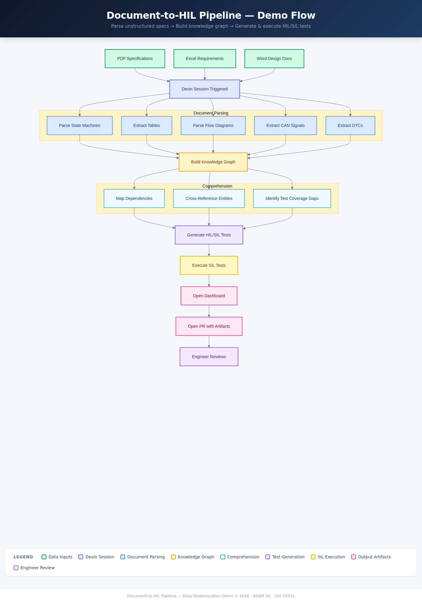
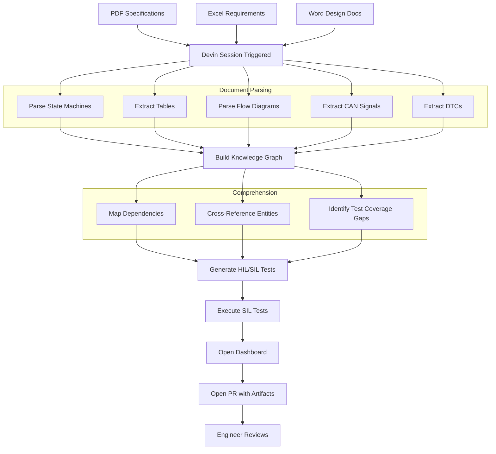

# Document-to-HIL Pipeline

Parse unstructured automotive specifications into structured knowledge, then generate and execute HIL/SIL tests — all inside a live Devin session.



[Interactive flowchart (HTML)](docs/flowchart.html)

<details>
<summary>Mermaid source</summary>



</details>

## What this demo shows

An OEM's engineering specifications live across PDFs (state machine diagrams, shift tables, flow diagrams), Excel files (requirements, test parameters), and Word documents (CAN signal catalogs, DTC matrices). Today, engineers Ctrl+F through these documents manually — root-cause analysis that should take 15 minutes takes a week. This demo shows Devin parsing those varied inputs into a structured knowledge graph, then generating and executing HIL/SIL tests automatically.

## What Devin does live

Devin is triggered against this repository and executes the full pipeline end-to-end: (1) parses all source documents — PDF specifications with state machines and flow diagrams, Excel requirements and test parameters, Word-format CAN signal catalogs and DTC matrices — into structured entities; (2) builds an in-memory knowledge graph linking requirements → signals → states → diagnostics; (3) generates HIL/SIL test scripts from the graph's state machine transitions; (4) executes the tests against the SIL replay harness with pre-captured CAN traces; (5) launches a live dashboard showing document inventory, knowledge graph metrics, and test results with full traceability. The audience sees the dashboard populate in real time as each pipeline stage completes, then Devin opens a PR containing all generated artifacts.

## How the demo runs

The presenter triggers a Devin session against this repo. Devin runs the full pipeline:

```
python -m parsers.orchestrator          # Parse all source documents
python -m comprehension.knowledge_graph  # Build knowledge graph
python -m generators.test_generator      # Generate HIL/SIL test scripts
python -m sil_harness.executor           # Execute SIL tests
uvicorn dashboard.app:app --port 5001    # Launch dashboard
```

The dashboard at `localhost:5001` shows real-time results — document inventory, knowledge graph node/edge counts, and SIL test verdicts with traceability to source requirements. Devin then opens a PR with all generated test scripts and result artifacts.

## Repo layout

```
source_documents/
  pdf_specs/         # PCM power modes, transmission shift logic (.md + .extracted.json)
  excel/             # System requirements, test parameters (.xlsx)
  word_docs/         # CAN signal catalog, DTC matrix (.md + .extracted.json)
parsers/             # Document parsers (PDF, Excel, Word) + orchestrator
comprehension/       # Knowledge graph builder + query engine
generators/          # HIL/SIL test generator (Jinja2 templates)
sil_harness/         # SIL replay executor + pre-captured traces
dashboard/           # FastAPI dashboard (templates, state, results JSON)
hil_output/generated/ # Empty — Devin populates this live
tests/               # pytest suite (parsers, comprehension, generator)
docs/                # Implementation plan, flowchart
```

## Key concepts

| Term | Description |
|------|-------------|
| **State Machine** | Extracted from PDF specs — PCM power modes (6 states, 11 transitions), transmission gear ranges |
| **Knowledge Graph** | In-memory graph linking documents → entities (states, signals, requirements, DTCs) via typed edges |
| **CAN Signal** | Controller Area Network bus signal definitions (message ID, start bit, length, scale, unit) per SAE J1939 / ISO 11898 |
| **DTC** | Diagnostic Trouble Code per ISO 15031-6 / SAE J2012 — maps faults to enable conditions and corrective actions |
| **SIL Replay** | Software-in-the-Loop test execution against pre-captured JSON traces (stands in for HIL hardware; ASAM XIL MAPort interface in production) |
| **Traceability** | Every generated test links back to its source requirement, source document, and CAN signals under test |
